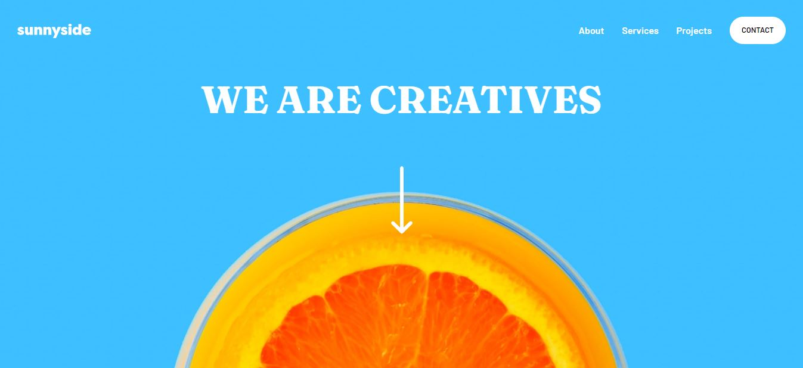

# Frontend Mentor - Sunnyside agency landing page solution

Essa é uma solução para o desafio [Sunnyside agency landing page challenge on Frontend Mentor](https://www.frontendmentor.io/challenges/sunnyside-agency-landing-page-7yVs3B6ef). 

## Table of contents

- [Overview](#overview)
  - [The challenge](#the-challenge)
  - [Screenshot](#screenshot)
  - [Links](#links)
- [My process](#my-process)
  - [Built with](#built-with)
  - [What I learned](#what-i-learned)
  - [Continued development](#continued-development)
- [Author](#author)


## Overview

### The challenge

O desafio consiste na construção de uma landing page, testando habilidades de layout e responsividade.

- Usuários conseguem observar a mudança do menu, quando a largura da tela atinge 768px;
- Quando acionado o menu para dispositivos mobile um overlay sobre a pagina aparece;
- O menu mobile pode ser fechado a partir de um click na tela ou com a tecla esc;
- Há também a mudança de alumas imagens usando JS para atender dispositivos mobile;
- Hover states de alguns botões;

### Screenshot




### Links

- Solution URL: [Add solution URL here](https://your-solution-url.com)
- Live Site URL: [Add live site URL here](https://your-live-site-url.com)

## My process

### Built with

- Semantic HTML5 markup
- CSS custom properties
- Flexbox
- CSS Grid
- JS Vanilla 


### What I learned

Selecionei partes do CSS e JS que foram mais desafiadoras no processo.


Fazer com que o texto do button ficasse sublinhado e que esse sublinhado ocupasse uma parte do texto.

```css
.btn.btn-yellow {
  background: linear-gradient(180deg, transparent 0 60%, hsla(51, 100%, 49%, 0.4) 60% 90%, transparent 90% 100%);
}
```
Tooltip usando CSS para o menu mobile

```css
 .mobile-menu ul::before {
    content: '';
    position: absolute;
    right: 0px;
    top: -20px;
    width: 0;
    height: 0;
    border: 12px solid;
    border-right-color: white;
    border-bottom-color: white;
    border-top-color: transparent;
    border-left-color: transparent;
  }
  ```
getWindowWidth - Função que obtem a largura da tela do usuário com window.innerWidth e é chamada para reconhecer o dispositivo inicialmente ou toda vez que a tela é redimensionada.
initialWidthSize - Reconhece a largura da tela e caso ela seja menor que 768px chama a função que muda as imagens para mobile.
window.addEventListener('resize', function()) - altera as imagens caso a tela seja redimensionada para uma largura menor que 768px ou o contrário.

```js
let windowSizeWidth = window.innerWidth;
function getWindowWidth() {
  windowSizeWidth = window.innerWidth;
}
function initialWidthSize() {
  getWindowWidth()
  if (windowSizeWidth <= 768) {
    changeImagesMobile();
  }
}
window.addEventListener('resize', function(){
  getWindowWidth();
  if (windowSizeWidth <= 768) {
    changeImagesMobile();
  } else {
    changeImagesDesktop();
  }
})
};
eggImage.src="/images/mobile/image-transform.jpg" ; //muda o caminho da imagem no HTML
```


### Continued development

Eu tive dificuldades com Flexbox para a section About.


## Author

- Meu perfil Frontend Mentor
- Frontend Mentor - [@yourusername](https://www.frontendmentor.io/profile/Phses)


